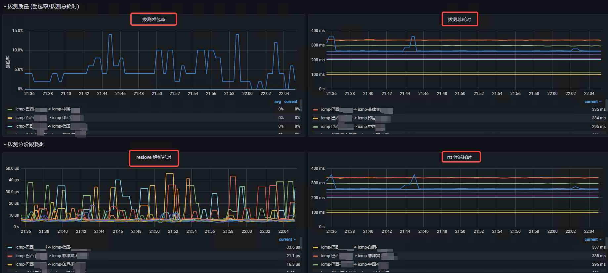

# ProberMesh

#### 什么是网格化探测？
```text
网格化探测通常是指各region/zone两两探测，形成一张 mesh 网格，通常是icmp探测的高阶需求;


probermesh 项目的优势
0. server/agent 二合一，单二进制部署；
1. 支持内网/公网模式下 icmp 自动发现，agent 一键部署自动加入 mesh 网格,不需要借助 consul 等额外组件;
2. 支持同 region 下的容错性；这块很重要，同 region 下可以部署多 agent,防止由于单台 agent 网络问题造成的探测失败 -> 告警噪音；
   server会对同region下结果agg, 同region下agent越多，数据越准确，越稳定，容错率越高；
3. 原生支持 prometheus, server 暴露openMetric数据供 prometheus 拉取;
4. 支持 icmp/http 两种探测形式，icmp mesh 和 http 多点探测 可共存;
5. 丰富的 metric 暴露，可结合 region 做灵活的自定义dashboard和告警策略;
6. agent 支持自升级，运维极简;
7. 集成任务下发功能，网络调试神器；
```

#### 分布式 C/S 网络网格探测框架

> ICMP 视野落在 Region to Region ；
>
> HTTP 视野落在 Region to URL ；
>
> 同 Region 下做 agg；
>
>Region 是此项目的核心概念，极其灵活，意义可以自定义。例如(K8s/host环境 prod/test环境 ali/gcp厂商 等)

- ##### 支持 ICMP/HTTP 分阶段耗时

- ##### ICMP 支持 resolve/rtt 分阶段耗时

- ##### ICMP 支持丢包率， 抖动标准差

- ##### HTTP 支持 resolve/connect/tls/processing/transfer 分阶段耗时 (httpstat)

####  

```text
# ping 指标
prober_icmp_failed   # icmp当前拨测失败数  gauge
prober_icmp_duration_seconds  # icmp拨测分阶段耗时 gauge
prober_icmp_packet_loss_rate  # icmp拨测丢包率 gauge
prober_icmp_jitter_stddev_seconds  # icmp拨测标准差 gauge
prober_icmp_duration_seconds_total # icmp拨测耗时分布 histogram

# http 指标
prober_http_failed  # http当前拨测失败数 gauge
prober_http_duration_seconds  # http拨测分阶段耗时 gauge
prober_http_ssl_earliest_cert_expiry  # tls指标

# 健康检查
prober_agent_is_alive  # agent存活情况 gauge

# 通用
server_receive_points  # server收到的上报点数 counter
```

#### 运维指南

```shell
# 项目构建
cd ProberMesh/cmd/probermesh && go build -o probermesh .

# 项目运行
./probermesh -h
Usage of ./probermesh:
    # 通用参数
    -mode string
        服务模式(agent/server) (default "server")
    -v    版本信息
    -h    帮助信息
    
    -log.dir string
      日志目录 (default "/logs/")
    -log.level int
        日志级别;
        PanicLevel 0
        FatalLevel 1
        ErrorLevel 2
        WarnLevel  3
        InfoLevel  4
        DebugLevel 5
        TraceLevel 6
         (default 3)
    
    # agent 端参数
    -agent.icmp.network-type string
        agent ICMP探测agent自身上报IP类型;
        intranet: agent上报内网IP地址，用与构建内网维度icmp网格；
        public: agent上报公网IP地址，用于构建公网维度下icmp网格；
         (default "intranet")
    -agent.probe.interval string
        agent端探测周期 (default "15s")
    -agent.region string
        agent端所属region/zone;不指定默认自动获取regionID (default "icmp-china-shanghai")
    -agent.sync.interval string
        agent端同步targets周期 (default "1m")
    -agent.upgrade
        agent端是否开启自升级功能,默认关闭
    -agent.upgrade.interval string
        agent端检查upgrade周期; 仅在指定 -agent.upgrade 后生效 (default "1m")
    -agent.rpc.report.addr string
        server端RPC地址 (default "localhost:6000")
    
    
    # server 端参数
    -server.aggregation.interval string
        server聚合周期 (default "15s")
    -server.http.listen.addr string
        serverHTTP监听地址 (default "localhost:6001")
    -server.rpc.listen.addr string
        serverRPC监听地址 (default "localhost:6000")
    -server.icmp.discovery string
        server端ICMP探测目标获取模式(static/dynamic);
        static:  各region下icmp探测地址按照配置文件为准;
        dynamic: 各region下icmp探测地址按照agent自上报服务发现为准，且会覆盖掉配置中同region下原icmp列表;
         (default "dynamic")
    -server.probe.file string
        server端探测列表文件路径
    -server.series.cache.ratio int
        server指标缓存时长重置倍率 (default 5)
    -server.task
        server是否开启task任务下发功能
    -server.task.meta.dir string
        server持久化task结果源目录 (default "./task_meta/")
   
  

# 探测列表文件(可选) -server.probe.file 参数所指定的配置
cat probermesh.yaml
prober_configs:
  - prober_type: http
    region: ali-cn-beijing
    targets:
      - http://www.baidu.com
      - http://www.taobao.com
  - prober_type: icmp
    region: gcp-ap-southeast-1
    targets:
      - 8.8.8.8
      - www.baidu.com


PS: region参数优先级
1. 命令行 -agent.region
2. 环境变量 PROBER_REGION
3. 代码curl云厂商region接口(仅支持aliyun)
4. 使用默认region cn-shanghai

其余参数可根据需要自定义调整


PS: -server.icmp.discovery 参数支持两种icmp发现模式
1. static静态发现:  icmp探测地址从静态配置文件中获取，需指定 -server.probe.file 参数配合使用，否则无icmp和http数据，启动没意义
2. dynamic动态发现: icmp探测地址由agent动态上报，并且agent 每1m (-agent.sync.interval) 向server同步一次，可自动生成一张icmp Mesh 网格

http仅支持通过配置文件指定，不支持自动发现模式
```


#### 效果展示

##### 1. ICMP 面板效果
直接导入 ./build/grafana/probermesh-icmp.json 至 Grafana 即可使用

> ICMP 拨测网格
>
> 
>
> 

##### 2. HTTP 面板效果

> HTTP 拨测


#### ProberMesh最佳实践

```shell
ICMP网格需求下:
- 内网互通环境下，使用server动态模式 -server.icmp.discovery=dynamic + agent内网模式 -agent.icmp.netowrk-type=intranet 拿到内网，以内网作为ip池上报server;
- 公网环境下，使用server动态模式 -server.icmp.discovery=dynamic + agent公网模式 -agent.icmp.netowrk-type=public 拿到公网ip，以公网网作为ip池上报server;

其余需求下:
使用server静态模式 -server.icmp.discovery=static + server指定配置文件 -server.probe.file=./probermesh.yaml 自定义互(ping/http)对象


########### 场景一: 公网icmp拨测网格化 ###########
# server 端使用
./probermesh \
-mode server \
-server.rpc.listen.addr=1.1.1.1:6000 \
-server.http.listen.addr=1.1.1.1:6001 \
-server.aggregation.interval=15s \
-server.icmp.discovery=dynamic   # 1. 设置为动态模式

# agent 端使用
./probermesh \
-mode agent \
-agent.region=ali-cn-shanghai \
-agent.probe.interval=15s \
-agent.sync.interval=1m \
-agent.icmp.network-type=public \   # 2. 设置为公网模式
-agent.rpc.report.addr=1.1.1.1:6000


########### 场景二: 内网互通icmp拨测网格化 ###########
# server 端使用
./probermesh \
-mode server \
-server.rpc.listen.addr=1.1.1.1:6000 \
-server.http.listen.addr=1.1.1.1:6001 \
-server.aggregation.interval=15s \
-server.icmp.discovery=dynamic  # 1. 设置为动态模式

# agent 端使用
./probermesh \
-mode agent \
-agent.region=ali-cn-shanghai \
-agent.probe.interval=15s \
-agent.sync.interval=1m \
-agent.icmp.network-type=intranet \  # 2. 设置为内网模式
-agent.rpc.report.addr=1.1.1.1:6000


########### 场景三: 非网格化icmp拨测 / 通用http拨测 ###########
# server 端使用
./probermesh \
-mode server \
-server.rpc.listen.addr=1.1.1.1:6000 \
-server.http.listen.addr=1.1.1.1:6001 \
-server.aggregation.interval=15s \
-server.icmp.discovery=static \   # 1. 设置为静态模式
-server.probe.file=./probe_mesh.yaml  # 2. 指定探测配置文件

# agent 端使用
./probermesh \
-mode agent \
-agent.region=ali-cn-shanghai \
-agent.probe.interval=15s \
-agent.sync.interval=1m \
-agent.rpc.report.addr=1.1.1.1:6000


###################
注意: 
脚本 script/probermesh_agent_deploy.sh 提供基于 supervisor 托管的公网网格拨测（场景一）agent一键部署功能；
场景二/三需要根据相应配置调整脚本中agent启动参数；

脚本使用方式:  sh probermesh_agent_deploy.sh ali-cn-shanghai
脚本后需要跟一个agent的region信息，对标 -agent.region

server端建议基于 supervisor 手动配置，因为配置较灵活且只需要一个节点，脚本主要解决agent的快速部署；
```


#### Prometheus 采集配置
```shell script
scrape_configs:
  - job_name: "probermesh"
    scrape_interval: 15s
    static_configs:
      - targets: ["$server.http.listen.addr"]
    metric_relabel_configs:
      - source_labels: ["__name__"]
        regex: "^prober.*"
        action: 'keep'
```


#### Server 端下发任务

##### 1. 需求及使用

```text
例如 我们在拨测不通的情况下可能会借助三方工具，例如 route, 例如 mtr 去进一步定位问题；基于这种场景，probermesh 集成了简单的任务下发系统；
若要使用功能，需要在 server 启动参数中指定 -server.task 来开启功能;

下发流程： 管理机向 server 端 http://${server_http_addr}/-/task 发送 POST 任务下发请求
{
    "region": "欧洲-美国-*",
    "expr": "=~",
    "cmd": "mtr -r www.baidu.com -c 20 -i0.1",
}
region 用来匹配合规的agent, 支持正则匹配；例如，我们只想让欧洲的节点执行命令，那么需要指定 region 为 "欧洲*" 或 "欧洲.+" 等；
expr 标识匹配的操作符，当前支持四种,分别是 "=" 匹配 / "!=" 不匹配 / "=~" 正则匹配 / "!~" 正则不匹配； 通过 region + expr 极其灵活的去下发任务；
cmd 需要执行的命令，不需要再加 bash -c , 直接写原命令即

agent端执行并上报后，可以在 server 端的 ./task_meta 目录下找到所有上报的任务； 具体目录可通过 -server.task.meta.dir 更改；
```
```text
# task_meta 目录
[root@test task_meta]# ll
total 4
-rw-r--r-- 1 root root 1417 Feb  8 16:12 美国-弗吉尼亚_xx.xx.xx.xx_2023-02-08_16-12-27
[root@test task_meta]# cat 美国-弗吉尼亚_xx.xx.xx.xx_2023-02-08_16-12-27 
commond:
mtr -r www.baidu.com -c 10 -i0.1 

output:
Loaded plugins: fastestmirror
Loading mirror speeds from cached hostfile
Package 2:mtr-0.85-7.el7.x86_64 already installed and latest version
Nothing to do
Start: Wed Feb  8 16:12:21 2023
HOST: test- Loss%   Snt   Last   Avg  Best  Wrst StDev
  1.|-- xx.xx.xx.x                 0.0%    10    0.5   0.4   0.3   0.5   0.0
  2.|-- xx.xx.xx.x                 0.0%    10    2.2   2.2   2.0   2.4   0.0
  3.|-- xx.xx.xx.x             30.0%    10    0.7   1.4   0.5   4.4   1.4
  4.|-- xx.xx.xx.x            90.0%    10    0.9   0.9   0.9   0.9   0.0
  5.|-- ae72.edge5.washington12.l 50.0%    10    8.5   7.1   1.2  21.2   8.3
  6.|-- 63.243.136.12              0.0%    10    4.6   1.9   1.5   4.6   0.9
  7.|-- if-ae-55-2.tcore3.aeq-ash 40.0%    10   71.3  71.3  71.0  71.8   0.0
  8.|-- if-ae-36-2.tcore2.lvw-los 50.0%    10   69.1  70.2  69.1  73.8   1.9
  9.|-- if-ae-2-2.tcore1.lvw-losa 40.0%    10   71.1  71.6  71.1  72.9   0.4
 10.|-- if-ae-60-2.tcore1.sv1-san 30.0%    10   71.3  71.8  71.1  73.3   0.6
 11.|-- if-ae-0-2.tcore2.sv1-sant  0.0%    10   68.8  69.2  68.8  70.7   0.3
 12.|-- xx.xx.xx.x               0.0%    10   68.9  68.8  68.7  69.0   0.0
 13.|-- xx.xx.xx.x              0.0%     9   69.9  70.1  69.6  72.1   0.6
 14.|-- xx.xx.xx.x             0.0%     9   68.3  68.3  68.3  68.3   0.0
```

#### Agent 节点自升级

##### 1. 需求及实现

```text
probermesh 部署后存在一种场景，我们需要对 agent 进行升级或bug fix；这在 C/S agent 二进制场景中是一种常见需求;
通用的批量升级方式无非如下几种
1. 手动替换二进制 restart
   弊端：操作繁琐,节点多了后需要耗费大量时间
2. ansible 自动化批量执行
   弊端: 节点多了后ssh执行效率很低
3. 基于 kubernetes 环境做 Deployment/DaemonSet replace
   弊端: probermesh 大部分场景是部署在同内网的多region, 或不同region通过公网通讯；使用k8s托管成本太高
4. self upgrade节点自升级
   弊端: 代码层面适配，大规模节点下升级有可能把管理机带宽打满(probermesh主要多对多拨测，节点数量不会很大，打满问题不太会发生)
5. ...


当前使用4实现自升级，这种实现方式有两个前提: 
1. agent 节点需要使用守护进程托管，例如 supervisord; 
2. agent 需要指定 -agent.upgrade 参数;


升级流程： 管理机向 server 端 http://${server_http_addr}/-/upgrade 发送 POST 升级请求：
{
    "downloadURL": "http://172.18.12.38:9999/probermesh",
    "md5Check": "0a85983226d91029bcf5701f94d18753",
    "version": "0.0.1",
    "force": false,
}
downloadURL： 标识agent新版本二进制的下载地址，这里要注意，二进制名称要和原启动命令二进制名称一致，否则守护进程会restart失败;
md5Check： 标识agent新版本的md5，agent需要和下载的二进制做md5校验，校验成功才会替换升级;
version： 标识新版本的version;
force： 标识是否强制升级，这里存在两种情况
    - false 情况下，正常升级，agent会进行 version check 看需要升级的版本否比当前版本高，如果符合条件，agent会进行调谐重启升级，直至成功升级到高版本为止；
    - true 情况下，强制升级，agent跳过version check,支持任意版本号，agent拿到升级信息后只会升级一次(无论成功或失败，原因是防止强制升级失败导致无限制升级重启，导致服务不可用)
```

##### 2. 自升级存在的问题
```text
agent升级是全量升级，如何做灰度或做并发控制？ 这种需求通常存在于 agent 节点规模很大的场景；
1. 需要一批批替换，例如两千个agent, 100台100台的升级；
2. 管理机需要限制带宽，防止带宽被打满；

由于probermesh目前暂无此需求，这里提供一个思路，后续有需求时再实现：
通过分布式锁hold agent upgrade count
```
